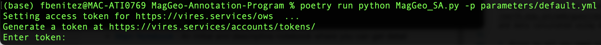
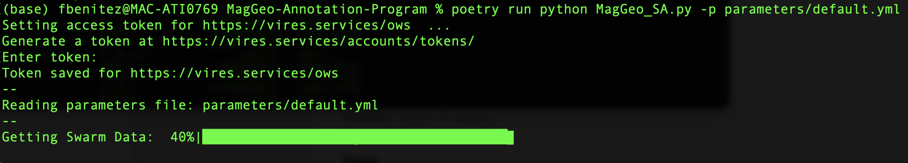
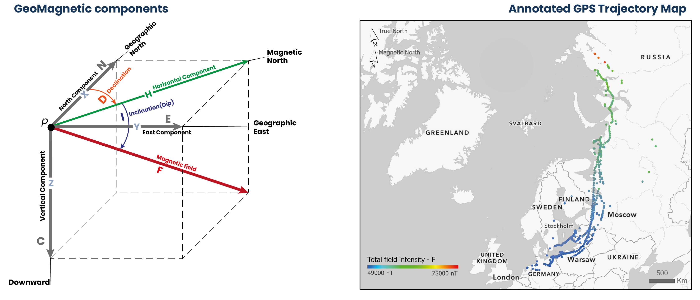

# MagGeo

[](https://zenodo.org/badge/latestdoi/289120794)
[](https://nbviewer.jupyter.org/github/MagGeo/MagGeo-Annotation-Program/blob/master/MagGeo%20-%20Home.ipynb)
[](https://vre.vires.services/hub/user-redirect/git-pull?repo=https%3A%2F%2Fgithub.com%2FMagGeo%2FMagGeo-Annotation-Program&urlpath=tree%2FMagGeo-Annotation-Program%2FMagGeo+-+Home.ipynb&branch=master)
[](https://mybinder.org/v2/gh/MagGeo/MagGeo-Annotation-Program/HEAD?filepath=MagGeo%20-%20Sequential%20Mode.ipynb)

## Data fusion tool to combine Earth's magnetic data from Swarm satellites with GPS trajectories

**Authors** | Fernando Benitez-Paez, Urška Demšar, Jed Long, Ciaran Beggan

**Contact**  | [Fernando.Benitez@st-andrews.ac.uk](mailto:Fernando.Benitez@st-andrews.ac.uk), [ud2@st-andrews.ac.uk](mailto:ud2@st-andrews.ac.uk), [jed.long@uwo.ca](mailto:jed.long@uwo.ca), [ciar@bgs.ac.uk](mailto:Fernando.Benitez@st-andrews.ac.uk)

**Keywords** | Bird migration, data fusion, Earth’s magnetic field, Swarm, GPS tracking

# How to install and Run MagGeo on your machine

To install and run MagGeo you need to follow the following steps.

## 1. Install Miniconda

Recommended setup if starting without Python already

Install Miniconda: [https://docs.conda.io/en/latest/miniconda.html](https://docs.conda.io/en/latest/miniconda.html)

## 2. Clone the MagGeo repository:

Open a new terminal and run:

```bash
git clone -b minconda_version https://github.com/MagGeo/MagGeo-Annotation-Program.git
```

## 3. Change the directory

You will need to change the directory to where you cloned/downloaded the MagGeo repository. If you donwloaded it--Do not forget to unzip the folder before using it.
If you're using the terminal on Linux or macOS, it is the same syntax to change directory.

```bash
cd MagGeo-Annotation-Program
```

## 4. Create MagGeoEnv environment  -- this should take around five minutes.

We have create a new virtual environment for you, thus you can keep MagGeo isolated from other python environment you might have. In the terminal run:

```
conda env create --file environment.yml
```

## 5. Activate MagGeoEnv

```
conda activate MagGeoEnv
```

## 6. Sign Up at VirES for Swarm - VRE and get a web client Token

**MagGeo** use [**VirES**](https://swarm-vre.readthedocs.io/en/latest/Swarm_notebooks/02a__Intro-Swarm-viresclient.html) (Virtual environments for Earth Scientists) a platform for data & model access, analysis, and visualization for ESA’s magnetic mission **Swarm**. This is a powerful client with the [viresclient API](https://swarm-vre.readthedocs.io/en/latest/Swarm_notebooks/02c__viresclient-API.html) that provide several classes and methods defined in the vires client package. The `viresclient` Python package allows you to connect to the VirES server to download [Swarm](https://earth.esa.int/web/guest/missions/esa-operational-eo-missions/swarm) data and data calculated using magnetic models.

1. First to all you need to create an account and Sign up using [https://vires.services/oauth/accounts/signup/](https://vires.services/oauth/accounts/signup/)
2. Once you have created the account, Log In [https://vires.services/](https://vires.services/)
3. Follow the instructions in [https://viresclient.readthedocs.io/en/latest/access_token.html](https://viresclient.readthedocs.io/en/latest/access_token.html) to get your token.
4. Copy and Paste your token after --token in the following command

## 6. Run MagGeo using the sample data.

MagGeo can be excuted using the same terminal you have been using in the previous steps. If you want to get familiar with MagGeo and get an annotated GPS trajectory using the data we have included as an example (data folder), run the following command:

```
python MagGeo_main.py -p parameters/default.yml --token YOUR_TOKEN_HERE
```

After some seconds MagGeo will ask you for the VirES token, just copy and paste inside the terminal and hit Enter.



Now MagGeo will start to download the Swarm Data.


Once the data has been downloaded, MagGeo will process it to make the annotation process ( for more information about how it is done, visit [our methodological paper in Movement Ecology](https://movementecologyjournal.biomedcentral.com/track/pdf/10.1186/s40462-021-00268-4.pdf))

The las step MagGeo does is annotating the gathered data, that would take more time depending how big your dataset is. In our example it only takes 4 seconds.



And **Congrats** **you got annotated data**. The results will be stored in the folder results for your futher analysis. You will find a .csv file named like **GeoMagResult_+name_of_your_csv_file_trajectory.**

### 6.1 Run MagGeo using your data.

If you are redy to annotate your GPS trajectories. You need to update the parameters file in MagGeo to let the program know what are the correct values of your data.

* Open and Update the following parameters in the file `default.yml` located in parameters folder:
* `gpsfilename: "name_of_your_csv_trayectory.cvs"` Include the name of your Input data. The GPS trayectory you need to annotate with the geomagnetic satellite data.
* `Lat: "latitude_column_name_in_your_trayectory"`
* `Long: "longitude_column_name_in_your_trayectory"`
* `DateTime: "Date_Time_column_name_in_your_trajectory"` make sure you have one column that includes Date and Time values together.
* `altitude: "altitude_column_name_in_your_trajectory"` if you do not have any altitute column, you can leave that in blank, including only `""`

Save your changes, return to the Terminal and run:

```
python MagGeo_main.py -p parameters/default.yml --token YOUR_TOKEN_HERE
```

## 7. Run MagGeo step by step, using Jupyter Notebook.

MagGeo includes a set of Jupyter Notebooks, you will find four notebooks (.ipynp).

* [Main Notebook](https://github.com/MagGeo/MagGeo-Annotation-Program/blob/master/MagGeo%20-%20Home.ipynb) : An initial and descriptive notebook where you can get detail information about MagGeo, the sample data used, background concepts and software requirements.
* [Sequential Mode](https://github.com/MagGeo/MagGeo-Annotation-Program/blob/master/MagGeo%20-%20Sequential%20Mode.ipynb): Annotation Notebook applying a sequential mode. Using  a traditional loop to going through the GPS track rows and process every row computing the magnetic components. Particularly useful for small datasets.
* [Parallel Mode](https://github.com/MagGeo/MagGeo-Annotation-Program/blob/master/MagGeo%20-%20Parallel%20Mode.ipynb):  If you have a "big" dataset ( e.g. 1 million of records) you might want try the parallel mode. The parallel mode has some differences when you run the required libraries in a windows or Linux environment. We have tested **MagGeo** in a windows server environment.
* [Notebook basics](https://github.com/MagGeo/MagGeo-Annotation-Program/blob/master/Notebook%20-%20Basics.ipynb): If you are not familiar with Jupiter Notebooks and want to learn about the basics over how to run the notebooks before try the annotate tool. You can try this notebook to get the basics elements to run cells, read data, and plot some a basic chart.

The following image will help you to understand how the sequential and parallel mode differ, and how in parallel mode you should be able to use the full capacity of your machine. However it is quite important to identify when we need to use a parallel mode. For small datasets running **MagGeo** in Parallel mode could be even slower than the sequential mode.


# What's MagGeo

MagGeo is a tool that helps ecologists or animal movement researchers to link  earth's magnetic field data from satellite source to GPS trajectories. Inspired by the Environmental Data Automated Track Annotation System (Env-DATA) Service a tool from Movebank and help researcher to get a better understanding about the geomagnetic variations across the GPS trajectories.

MagGeo is entirely built-in python and using a set of Jupyter Notebooks that offer several ways to link GPS tracks with the geomagnetic components using the data from one of the up-to-date satellite sources - Swarm Constellation. MagGeo will create an enriched GPS track with the following components:

- **Latitude** from the GPS Track.
- **Longitude** from the GPS Track.
- **Timestamp** from the GPS Track.
- **Magnetic Field Intensity** mapped as Fgps in nanoTeslas (nT).
- **N (Northwards) component** mapped as N in nanoTeslas (nT).
- **E (Eastwards) component** mapped as E. in nanoteslas (nT).
- **C (Downwards or Center)** component mapped as C in nanoTeslas (nT).
- **Horizontal component** mapped as H in nanoTeslas (nT).
- **Magnetic Declination or dip angle** mapped as D in degrees
- **Magnetic Inclination** mapped as I in degrees
- **Kp Index** mapped as kp
- **Total Points** as the amount of Swarm measures included in the ST-IDW process from the trajectories requested in the three satellites.
- **Minimum Distance** mapped as MinDist, representing the minimum distance amount the set of identified point inside the Space Time cylinder and each GPS point location.
- **Average Distance** mapped as AvDist, representing the average distance amount the set of distances between the identified Swarm Point in the Space Time cylinder and the GPS Points location.

Researchers, particularly ecologists now can study the annotated table to analyze the geomagnetic Spatio-temporal variation across any GPS trajectory.



# Problems?, Suggestions? - Contact us

**MagGeo** is work in progress and we are constantly making improvements that you call follow up with the commints made in the pubic GitHub repo. For general enquiries, scientific concepts, suggestions, bugs or improvements using **MagGeo** please email: [Fernando.Benitez@st-andrews.ac.uk](mailto:Fernando.Benitez@st-andrews.ac.uk), [ud2@st-andrews.ac.uk](mailto:ud2@st-andrews.ac.uk), <jed.long@uwo.ca>
