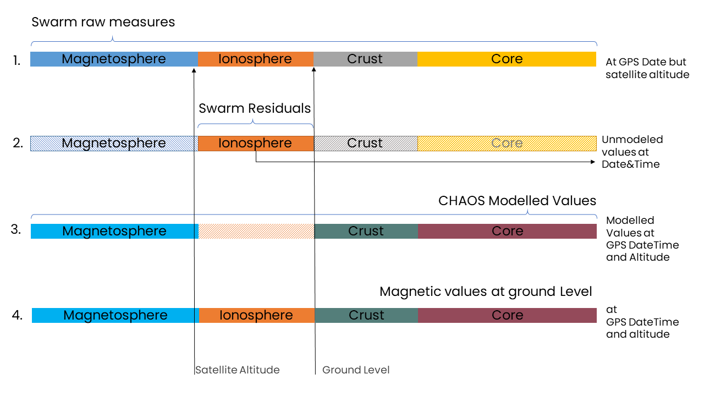

# Calculation of Magnetic Components

MagGeo calculates the magnetic components at the ground level using the Swarm data and the CHAOS model. The magnetic components are calculated in the North-East-Center (NEC) reference frame, which is a local coordinate system aligned with the Earth's magnetic field.

Swarm data provide information on the earth's magnetic field at the orbit level, which is above the ionosphere, where geomagnetic field is affected by the electrical currents induced by the interaction of the solar wind and magnetosphere ( see the figure above to understand the vertical contributions of the earth' magnetic field). This means that to obtain the values of the magnetic field on the Earth’s surface where animals are migrating, the raw measurements from Swarm need to be corrected removing the effects from the modeled values from core, crust and magnetosphere.

We do this in three steps:

**1.** We download the swarm residuals for the GPS date, getting essentially the unmodelled ionospheric field contribution that we haven’t captured in any of the other models.

**2.** Because at the ground level the core and crust contributions are strongen than the ones at the satellite altitude, We use the CHAOS model to compute the core, crust and magnetosphere contributions for the particular, latitude, longitude, datetime and altitude of each GPS point.

**3.** Finally we add those values modeled by CHAOS values with the Swarm residuals, computing a comprehensive magnetic values than include the stronger core and crust contributions and the unmodellled values from the satellite altitude that capture all the inoshpere field contributions. For details of this correction see Supplementary Information 1 in our main paper.

!!! info 
    **CHAOS**: It is a comprehensive field model, containing the modeled contributions of the time-varying core, the static crustal field, the average time-varying magnetosphere. We show calculation of the residuals (adding this parameter `residuals=True`) which means: data - `CHAOS(Core+Static+Magnetosphere)`

The **CHAOS** model is available on the server as model variables:

-   CHAOS-Core: SH degree 1-20
-   CHAOS-Static: SH degree 21-110
-   CHAOS-MMA-Primary: Magnetosphere external field, SH degree 1-2
-   CHAOS-MMA-Secondary: Magnetosphere internal induced field, SH degree 1-2

The updated version of MagGeo uses the latest version of the CHAOS model, which is CHAOS-8. This model provides a comprehensive representation of the Earth's magnetic field, including contributions from the core, crust, and magnetosphere. Using `pooch` library, MagGeo automatically downloads the latest CHAOS model data when needed. The model is stored in a local cache to avoid repeated downloads.
For more information about the CHAOS model, you can visit the official website: [CHAOS-8](http://www.spacecenter.dk/files/magnetic-models/CHAOS-8/).

