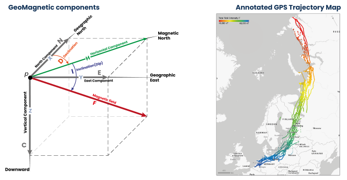

# What's MagGeo

{ align=left }

MagGeo is a tool that helps ecologists or animal movement researchers to link earth's magnetic field data from satellite source to GPS trajectories. Inspired by the Environmental Data Automated Track Annotation System (Env-DATA) Service a tool from Movebank and help researcher to get a better understanding about the geomagnetic variations across the GPS trajectories.

MagGeo is entirely built-in python and includes a two Jupyter Notebooks that offer two ways to link GPS tracks with the geomagnetic components using the data from one of the up-to-date satellite sources - Swarm Constellation. MagGeo will create an enriched GPS track with the following components:

-   **Latitude** from the GPS Track.
-   **Longitude** from the GPS Track.
-   **Timestamp** from the GPS Track.
-   **Magnetic Field Intensity** mapped as Fgps in nanoTeslas (nT).
-   **N (Northwards) component** mapped as N in nanoTeslas (nT).
-   **E (Eastwards) component** mapped as E. in nanoteslas (nT).
-   **C (Downwards or Center)** component mapped as C in nanoTeslas (nT).
-   **Horizontal component** mapped as H in nanoTeslas (nT).
-   **Magnetic Declination or dip angle** mapped as D in degrees
-   **Magnetic Inclination** mapped as I in degrees
-   **Kp Index** mapped as kp
-   **Total Points** as the amount of Swarm measures included in the ST-IDW process from the trajectories requested in the three satellites.
-   **Minimum Distance** mapped as MinDist, representing the minimum distance amount the set of identified point inside the Space Time cylinder and each GPS point location.
-   **Average Distance** mapped as AvDist, representing the average distance amount the set of distances between the identified Swarm Point in the Space Time cylinder and the GPS Points location.

Researchers, particularly ecologists now can study the annotated table to analyze the geomagnetic Spatio-temporal variation across any GPS trajectory.

# About MagGeo

The research and the consequently developed method have been initially inspired by The Environmental Data Automated Track Annotation System (Env-DATA) Service a tool on Movebank, where ecologists and animal movement researchers all over the world can link movement data with global environmental datasets. Including hundreds of variables from a diverse set of data sources including the European Space Agency (ESA), the National Aeronautics and Space Administration (NASA), the US National Oceanic and Atmospheric Administration (NOAA), and others. EnvData allow researchers to annotate in space and time multiples environmental information to enrich their GPS tracks to analyze the influence of several environmental variables in the trajectory. Using the [Env-DATA Track Annotation Service](https://www.movebank.org/cms/movebank-content/env-data-track-annotation) registered users on MoveBank are able to get environmental parameters—such as wind conditions, land use, vegetation, and snow cover—for the whole world. Using different interpolation methods users can include multiple environment variables selecting from a comprehensive list of datasets (you can browse the available dataset [here](https://www.movebank.org/cms/movebank-content/envdata-products)).

The second aspect that inspired the development of **MagGeo** was creating a tool to help researcher to get a better understanding over how the earth's magnetic field is being used by birds as one of their navigational strategies. Despite of there are several approach in this regards we know still have little knowledge about how birds can use the influence of the magnetic field for their migration patterns, especially for those long-distance migratory animals. Other studies have been reflecting into the magnetic field influence based on magnetic field estimation models, or using some displacement experiments with particular species. The disadvantage of those previous studies is the magnetic field is a highly dynamic force that have different impact around the earth every day. Having said that MagGeo wants to take advantage of what is considered best survey of the geomagnetic field and its temporal evolution - Swarm Constellation. Swarm is a ESA’s magnetic field mission, launched on 22 November 2013, consists of the three identical **Swarm satellites** (**A**lpha, **B**ravo, and **C**harlie). Swarm A and C flying side-by-side (1.4° separation in longitude) at an altitude of 462 km (initial altitude) and Swarm B at higher orbit of 511 km (initial altitude) are equipped with the following set of [identical instruments](https://earth.esa.int/web/guest/missions/esa-eo-missions/swarm/instruments-overview).

The data products available from Swarm are Level 1b and Swarm Level 2 products. These products include Swarm magnetic field models, ionospheric and thermospheric products, and others. MagGeo use the Swarm Level 1b data product as the corrected and formatted output from each of the three Swarm satellites. For more information about the Swarm Data Products click [here](https://earth.esa.int/web/guest/missions/esa-eo-missions/swarm/data-handbook).

MagGeo was initially deployed using a set of Jupyter notebooks a powerful tool to run a python environment. Completely build in python. Today is a sophisticated and modern Python library available in PyPI to let any animal movement researchers to downland and analysis trajectories with the geomagnetic components included.

**MagGeo** uses [**VirES**](https://swarm-vre.readthedocs.io/en/latest/Swarm_notebooks/02a__Intro-Swarm-viresclient.html) (Virtual environments for Earth Scientists) a platform for data & model access, analysis, and visualisation for ESA’s magnetic mission **Swarm**. This is a powerful client with the [viresclient API](https://swarm-vre.readthedocs.io/en/latest/Swarm_notebooks/02c__viresclient-API.html) that provide several classes and methods defined in the vires client package. The `viresclient` Python package allows you to connect to the VirES server to download [Swarm](https://earth.esa.int/web/guest/missions/esa-operational-eo-missions/swarm) data and data calculated using magnetic models.

# Suggestions?

**MagGeo** is work in progress and we are constantly making improvements that you can follow up with the commits made in the pubic GitHub repo. For general inquiries, scientific concepts, suggestions please email: [Fernando.Benitez\@st-andrews.ac.uk](mailto:Fernando.Benitez@st-andrews.ac.uk), [ud2\@st-andrews.ac.uk](mailto:ud2@st-andrews.ac.uk), [jed.long@uwo.ca](mailto:jed.long@uwo.ca)

For **errors**, or **improvements** please submit an [issue](https://github.com/MagGeo/MagGeo/issues) in this repo, describing the problem.